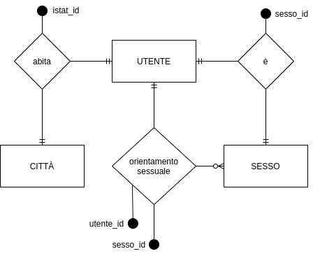

# Bonoldi Enrico, Classe 5AI <!-- omit in toc -->

## ELABORATO INDIVIDUALE DI INFORMATICA E SISTEMI E RETI <!-- omit in toc -->

- [INFORMATICA](#informatica)
  - [1. *Analisi*](#1-analisi)
    - [Soluzione proposta](#soluzione-proposta)
    - [Tecnologie utilizzate](#tecnologie-utilizzate)
      - [lato server](#lato-server)
      - [lato client](#lato-client)
    - [Struttura](#struttura)
    - [*Supposizioni*](#supposizioni)
    - [*Possibili sviluppi futuri*](#possibili-sviluppi-futuri)
  - [2. *Modello concettuale e logico*](#2-modello-concettuale-e-logico)
      - [MODELLO ER](#modello-er)
      - [MODELLO LOGICO](#modello-logico)
- [SISTEMI E RETI](#sistemi-e-reti)

--- 
## *Descrizione* 
> Un’agenzia matrimoniale vuole gestire e pubblicare con un’applicazione web le informazioni per la
ricerca della propria anima gemella in un dato territorio.

# INFORMATICA

## 1. *Analisi*

Soggetto : Agenzia Matrimoniale  
Clienti : Chiunque (vedi supposizioni...)

L'applicativo deve fornire l'accesso alle azioni di ricerca in modo semplice e veloce.

> *Entrando in un ambito così personale è necessario tener conto della sicurezza relativa ai dati sensibili.*

### Soluzione proposta

La scelta dell'abiente è ricaduta su nodeJS e expressJS data la loro immediatezza e velocità di sviluppo.
Offrono stumenti (validator,session manager,...) che permettono di gestire in sicurezza le parti piu critiche della applicazione quali inserimento di dati e autenticazione.

###  Tecnologie utilizzate

#### lato server
- [NodeJS](https://nodejs.org/it/)
- [ExpressJS](https://expressjs.com/it/)
  - [express-session](https://www.npmjs.com/package/express-session)   
  - [EJS](https://ejs.co/) (templating) 
  - [pg](https://www.npmjs.com/package/pg)

#### lato client
- HTML
- CSS
- Javascript

### Struttura

La struttura del progetto è la seguente:
- **Accesso**
  - **Registrazione**
  - **Login/Logout**
- **Ricerca**
- Gestione profilo

##### in grassetto i servizi implementati nella soluzione finale. <!-- omit in toc -->

### *Supposizioni*

1. gli iscritti al sistema siano maggiorenni.
2. l'orientamento sessuale di ogni utente può essere maschio e/o femmina.
3. ricerca
   1.  basata sulla distanza tra i comuni di residenza degli utenti dal quello dell'utente che ricerca.
   2.  basata sul orientamento sessuales

### *Possibili sviluppi futuri*

1. Ampliamento profilo e ricerca (carattere, aspetto,...)
2. Messaggistica istantanea.

## 2. *Modello concettuale e logico*

#### MODELLO ER

#### MODELLO LOGICO

CITTA(<ins>istat_id</ins>,comune,provincia,regione,posizione)  
CAP(*<ins>istat_id</ins>*,<ins>CAP</ins>)  

SESSO(<ins>id</ins>,nome)
UTENTE(<ins>id</ins>,email,password,nome,cognome,data_nascita,*sesso_id*,*residenza_id*,telefono)

)

# SISTEMI E RETI 
